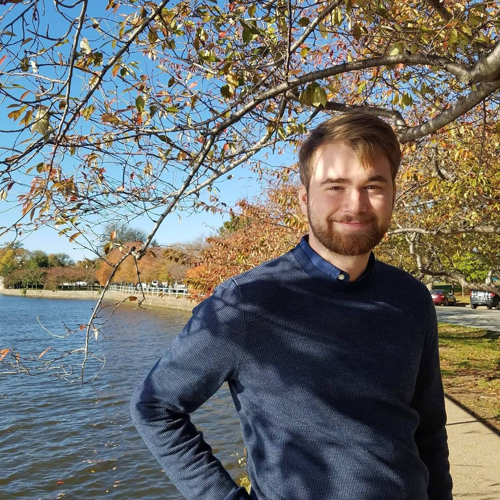

I am a Ph.D. student in Environmental Science, Policy, and Management at UC Berkeley. Through contributions to statistical ecology, I build tools and develop methods to allow humans to learn more about what Earth's other animals are up to. In the long term, I will contribute to conservation and wildlife management efforts to stop the human-caused mass extinction currently threatening the balance of the biosphere.

I graduated from [American University](https://www.american.edu/) in 2018 with degrees in [Philosophy](https://www.american.edu/cas/philrel/) and [Environmental Science](https://www.american.edu/cas/environmental/).
I developed a passion for computational environmental tools while building open-access emissions inventories at the Joint Global Change Research Institute ([JGCRI](http://www.globalchange.umd.edu/)).