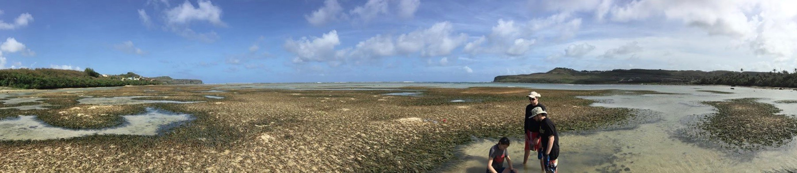

### Ongoing
My dissertation at UC Berkeley focuses on the ecological relevance of "citizen science" databases like [eBird](ebird.org) and [iNaturalist](inaturalist.org).

### Past
As an undergraduate at American University, I worked in Dr. Kiho Kim's marine ecology lab assessing Guam's benthic habitat space. I co-authored an article on the decline of seagrass beds in the Northern Marianas and how this will impact the ecosystem's ability to act as a carbon sink.

I worked as a research student for the Joint Global Change Research Center, a collaboration between Pacific Northwest National Lab and the University of Maryland. I helped develop the [Community Emissions Data System](http://www.globalchange.umd.edu/ceds/), a public and open-source global emissions inventory. This system calculates emissions of a number of key pollutants (e.g. CO~2~, CH~4~, NOx, particulate matter) for every year from 1750-2014 by country, fuel source, and sector. The system's design allows users to specify input data and re-calculate final results. I focused on the development of code to allow users to specify historic fuel use and conducted a study estimating global emissions from domestic waste burning (paper in progress).